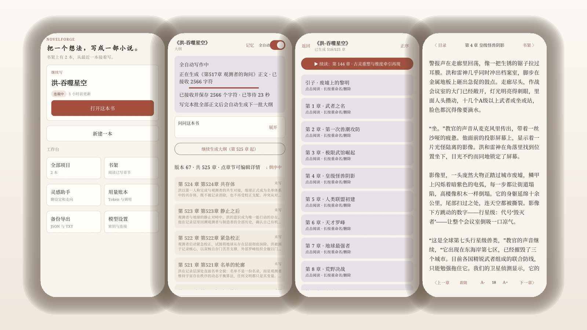
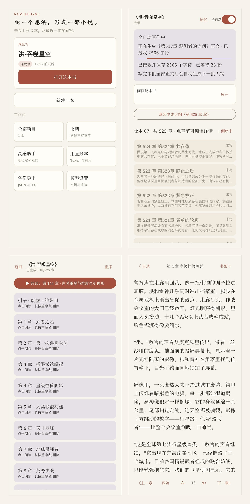

<div align="center">

# NovelForge

### 把一个想法，写成一部小说。

本地优先的 Android 长篇写作应用。
你带自己的模型 Key，程序负责记住设定、续上上下文、把生成任务跑完——模型只负责写字。

**[下载 APK](#下载)** · **[能做什么](#能做什么)** · **[已知边界](#已知边界)**

</div>

---

## 你大概遇到过这些

用 AI 写长篇，写到后面总有两件事让人想放弃。

**第一件，设定被挤出上下文。** 主角第一把刀叫什么、左臂是什么时候断的、立过什么誓，写到第三百章全忘了。模型每轮只能看到最近那段对话，开头的设定早被挤到看不见的地方。你只能一次次把设定重新贴进去，贴到后面 prompt 比正文还长。

**第二件，模型自己脑补的东西被当成了事实。** 它抽出一条笔记、一句推测，你没点头，下一章它就当成已经发生过的事来写。矛盾越积越多，你还说不清是哪一步开始歪的。

NovelForge 就是冲着这两件事做的。

---

## 它是怎么解决的

写下一章之前，程序会先从这本书的连续性状态里挑出该带的东西：**点名的角色、已确认的事实、还没收的伏笔、不能违反的规则**——按固定预算挑，不是全量塞。

默认名额是 6 个角色、10 条伏笔、12 条事实、8 条规则。被点名的角色连同它最早的旧设定优先占名额，本章用不上的角色和伏笔可以单独排除。单个字段还会按输入预算截断，避免一条写了三千字的人物小传把 prompt 撑爆。

有三条规矩值得单独说：

**没确认的笔记，不进 prompt。** 章后模型会抽出它觉得"后文要记住的事"，但这些条目先躺在"待确认"里。你点"记成事实"或"记成伏笔"，它才进入下一章的上下文。模型猜测的内容，永远不会悄悄变成你书里的设定。

**按本章捞回，而不是只留最近。** 本章要点名哪个角色，就把那个角色最早的旧设定优先捞回来。同样名额下，这是"记住"和"忘了"的区别。

**结构不合法的输出，不写进正文。** 大纲和章节必须返回约定的 JSON。校验不过就停在"需要处理"，你可以在修复框里手改，也可以点重试——绝不会把残缺的片段静默写进你的书里。

同一份固定名额下，三种取法的对照（7 个角色、20 条已确认事实、1 条未确认笔记，本章点名其中一个角色及其最早的旧设定）：

| 策略 | 本章必须记住的旧设定 | 未确认笔记漏进 prompt |
|---|---|---|
| 不带记忆 | 0/3 | 0 |
| 只留最近 | 1/3 | 0 |
| 按本章捞回 | **3/3** | 0 |

「只留最近」能中的那 1 项是伏笔：伏笔是往后追加的，所以从最新的一条开始保，你刚加的那条不会被挤掉。角色仍然拿不到（存进去的就是 6 个路人，主角排在第 7 个），事实也仍然是 12 条最新的杂事。

「全量塞入」不在这个表里，因为它不守名额——它确实能记住 3/3，但会把那条未确认笔记一起发出去，而且 prompt 更长。这就是"按预算挑"而不是"全量塞"的理由。

```powershell
.\gradlew.bat :app:testDebugUnitTest --tests com.novelforge.app.infrastructure.llm.ContinuityBenchmarkTest
```

度量的是"下一章 prompt 里有没有留下必须记住的旧设定"，不是正文写得好不好。这条测试不调用模型，上面每个数字都是它断言出来的。

---

## 能做什么

### 从零到一整本

起个名，然后告诉它题材、主角、核心冲突。可选的口味有：八类题材标签（玄幻 / 都市 / 悬疑 / 科幻 / 历史 / 言情 / 现实 / 奇幻）、五种叙事风格（文艺 / 通俗 / 古典 / 网文风 / 自定义）、五种基调（轻松 / 严肃 / 幽默 / 压抑 / 自定义）、三档爽感频率（每章高潮 / 每 3 章高潮 / 慢热铺垫 / 自定义），叙事风格和基调各有 1–5 的强度。章节数和每章目标字数也在这步定——最高 1500 章，每章 500–10000 字，常用档位是 2000 / 4000 / 6000 / 8000 字。

大纲是**分批次生成**的，每批 10 章。写完本批正文，它自己接着生成下一批大纲，你不用反复点。

### 菜单怎么分的层

底部三个一级入口：**书架 · 灵感 · 设置**。就三个。

- **书架**是唯一的书籍列表。**点封面 = 进这本书**（写过一次的书打开章节目录；一次都没写过的送去写作，因为空书的目录页是一片「未生成正文」的死胡同）。**长按 = 管理菜单**：继续写作 / 阅读 / 导出整本备份 / 换封面 / 重命名 / 删除。长按菜单里第一项是「继续写作」，所以主动去写也有出路。

  要「直接读上次那一章」是另一个动作：书内目录顶部有「▶ 续读：第 N 章」。**点封面不会替你跳进阅读器** —— 它给的是「进这本书」，停在目录，读哪一章由你选。

  阅读曾经是「次要动作」——写作是这个 app 的主动作，所以点封面进的是写作界面。现在反过来了：多数时候你是读完一段接着写下一段，**读**才是那个高频动作。两个门指向同一份书单的老问题（以前有「全部项目」和「书架」，两者互不相通，从书架进了一本书就回不来）仍然不成立。
- **灵感**是聊天。从书内「更多」里打开时，会话按这本书分桶：A 书聊的人设不会被重发进 B 书的提问。**从书里打开时顶栏有返回**（那是回这本书的唯一路，底栏三个 tab 里没有一个是「这本书」）；从底栏「灵感」进则不给返回，底栏就在下面。
- **设置**是一个 hub，不是设置列表本身。连接、外观、壁纸在这一页；用量账本和备份与导出是它的二级页（那两页有自己的返回，因为「上一层」不是 tab）。设置本身只能从底栏进，所以顶栏没有返回。

书内是三层：**创作设置 → 大纲（书的 hub）→ 正文**。大纲页是书的中心，生成控制、章节目录、写这一章、记忆、就这本书提问都在这儿，但「全自动」的开关不在标题栏里——它跟「一键全自动生成全书」按钮放在一起，因为它和那个按钮是同一个意图。写正文和创作设置是单任务页，不显示底部栏，但**返回键一直在**。

一条原则：**同一本书只有一个门**。想「回到这本书」而不是「回到 App 首页」——以前正文页上的那一键会把大纲和正文两层一起弹掉，书里读到第几章这个信息在写作侧从来没被记下来过。

另一条：**底栏能到的页面，顶栏不再给一个返回。** 书架、设置都遵守；灵感助手例外——从书里打开时底栏三个 tab 里没有一个是「这本书」，返回是唯一的退路，所以那种情况下才给。反过来，**没有底栏的页面（新建小说、创作设置、正文）返回必须留着**，那是唯一看得见的出路。

### 大纲页

书架式的章节总览，点任意一章进去改标题和概要。改不动的章节会标成"已写正文"，并提醒你改大纲不会自动改正文。

还有一个 **✦ 优化本章概要**：按你手改的方向润色本章大纲，跑完变 **↺ 撤销优化**，随时退回你原来的版本。等待期间如果你又手动改了，AI 的结果直接作废，绝不覆盖你手打的内容。

任何时候都能**从某一章起重生成**，它会明确告诉你这一刀会删掉多少章大纲、其中几章已写好的正文会被永久删除，让你确认后再动手。

### 正文页

流式生成，边写边存。中断了、限流了、校验没过，任务会停在对应状态并告诉你原因——可以取消、可以重试、可以打开修复框手改模型的原始输出。

**往上翻的时候，正在生成的段落不会把你顶走。** 手指按在屏幕上、或者你已经离开底部时，页面会定住当前这份段落列表，新到达的段落先攒着；等你回到底部，它再跟上。这是长文边写边读的前提——以前无论你怎么翻，列表都会跟着流式输出一起动。

每一章都有修订记录。**"和上一稿对照"** 并排看两版，确认旧版更好就一键回去，当前版会作为新修订保留，不会丢。

### 本书记忆

角色（名字、外貌、性格、动机、别名）、不能违反的规则、还没收的伏笔，都是你维护的。模型抽出来的待确认条目在这里处理，**确认之后才会进入下一章**。

写这一章之前，页面会告诉你这次会带几个角色、几条伏笔、几条已确认事实——**以及有多少条因为名额不够这次没带**。以前这里报的是「排除之后的全长」，于是 20 个角色会显示成「会带上 20 个角色」，而 prompt 里其实只有 6 个。被落选的那 14 个不会告诉你，你只会读成「我明明写了它却不用」。

几条让它真正好用的规则：

- **置顶**。点一条已确认事实的「置顶」，它每章都带，而且排在最前面，不受新旧排序影响。（这一条以前注释里写着、代码里没实现——两条选择路径最后都有一层按时间的排序，把置顶的主序键整个抹掉了。现在是真的。）
- **别名**。角色写了「剑尊」「老鬼」这类称号，章节概要里出现别名也算点名。没有这一条时，正文里用称号称呼的角色永远带不回他的设定。
- **规则和伏笔按相关度取，不是按顺序截断**。伏笔是往后追加的，所以从最新的一条开始保——你刚加的伏笔不会被排在第 11 位以后就永远发不出去。
- **矛盾会被顶掉**。确认一条新设定时，说的是同一件事的旧设定会被替换，而不是两条互相矛盾的事实一起占着名额、一起发给模型。
- **待确认队列能看全**。队列存 40 条，界面默认只显示最后 12 条，但有「还有 N 条，全部展开」。以前没有这个展开，另外 28 条你永远处理不掉，然后被下一章悄悄挤掉。

### 就这本书提问

针对这本书提问。程序只附上大纲和相关片段，不发送全文。回答存在本地。

它是一个**按需查询工具**，不是写作主循环的一环，所以入口放在大纲页右上角的「更多」里，而不是和「一键全自动生成全书」抢同一个位置。长书不会把整本大纲发出去——只发最近 30 章的纲要，加上最多 4 章和问题最相关的正文片段（每段截前 160 字），并说明省略了多少。1500 章的稿子整个发出去会直接把上下文撑爆，表现为「这本书它好像不认识」。

### 灵感助手

卡壳的时候聊一聊。空状态是「还没有灵感？说说你的想法」。它会一次给 2–4 个方向不同的方案，每个方案点明核心亮点和可能踩的坑，而不是空谈创作理论。回复按 Markdown 渲染，公式按 LaTeX 排。每条回复下面有一行复制按钮——不是长按菜单：长按要留给选词，系统工具栏自带复制 / 全选 / 分享，两者只能选一个。

可以发图和文本附件。图片会等比缩到长边 1568 像素、再压到 1.4 MB 以内；只有最近 4 条消息的附件会随请求重发，翻久了的对话不会因为附件把请求撑爆。附件也按书分桶。

**每组对话有自己的「思考」开关**，和设置里那个全局「关闭思考模式」刻意分开：全局那个管大纲和正文生成。开着时模型的思考过程实时可见，能中途掐断、保留已生成的部分。

**切走再回来，回复不会丢。** 以前按返回键离开灵感助手，正在流式输出的那一轮会被直接掐断，半句回复留在屏幕上，回来看不见了。现在生成在后台继续，每 3 秒落一次盘，进程被系统杀掉也能从断点续上；实在续不上的那半句会标成「生成被中断，以上是已经收到的部分」，不会假装是完整回复。

对话自动存进历史，可以开多组并行聊。

### 书架与阅读器

封面墙，点进去就是目录。一键**续读**回上次读到的地方。阅读支持四套主题（跟随 / 白纸 / 护眼 / 夜间）、字号 12–30 可调、上一章下一章跳转。章节可以重命名、删除。

**长按封面**可以换封面、重命名、删除、导出整本备份，也可以从这里主动进写作。挑一个底色，或者从相册选一张自己的图（自动居中裁成竖版，不会被压扁）。删书时会一并清掉封面文件和这本书的自动运行开关。

### 用量账本

每一次调用的 Token 都记账：净输入、缓存命中、输出分开算，成功率、按模型排行、按项目分布。只统计 Token，不换算费用——账单以你的服务商为准。明细可按今天 / 近 7 天 / 近 30 天 / 全部筛，翻页看每一次调用。

模型排行只列前 3，并写明「前 3 / 共 N 个」——这一栏是排行，不是明细，列全了没有阅读价值。项目分布不截断，因为那是一份分布而不是一张榜单。

**思考 token 不单列。** 它本来就含在输出里，而且默认不开思考时这一项恒为 0，单列出来只会让人以为漏算了。

### 备份与换机

整书备份成一个 JSON，包含项目设定、全部大纲版本、全部正文修订。**不含 API Key，不含封面文件、对话历史、附件、界面预设、设置和账本。**

导入时所有 id 重新分配，所以导入备份得到的是**一本新书**，不会覆盖你现有的任何一本书。

TXT 另外导出，保存在手机「下载/NovelForge/」文件夹，可以离线看，也可以直接分享。

---

## 界面

<p align="center">
  
</p>

<p align="center">
  
</p>

---

## 数据边界

**API Key 只以 Android Keystore 保护的 AES-GCM 密文存在这台手机上。** 备份不含 Key，日志和崩溃上报不含 Key、prompt 和正文。

你主动提交的内容和设定，会发给你自己配置的那个模型服务，留存政策以该服务商为准。除此之外，这本书的设定、大纲、正文、对话，都留在这台设备上。

Base URL 必须是 HTTPS，本机 localhost 除外（`127.0.0.1` / `::1` 允许 HTTP，方便接本地推理服务）。

云同步、社区、TTS、AI 配图和让模型给自己打分，不在当前范围内。

---

## 下载

**[Releases 页面](https://github.com/ausyeah/NovelForge/releases/tag/v0.2.0-beta50)** 提供可直接安装的 release 构建 APK，可安装到 Android 8 及以上。

装好后到「设置 → 连接」里填自己的 OpenAI-compatible 接口（服务商名称、Base URL、模型名、API Key）。接口可以存多套预设，同一服务商的不同接口会自动标成「名称（2）」，点一下就拉回表单改。模型列表默认收起，点开才展开，避免几十个模型把这一页撑满。

**如果它刚好帮到了你，点个 Star 就是最好的反馈。**

---

## 自己构建

Android 原生，Kotlin，Jetpack Compose，`minSdk 26`。本地数据在 Room，后台生成用 WorkManager。

- JDK 17
- Android SDK Platform 35
- Gradle Wrapper 8.9

把本机 SDK 路径写进 `local.properties`（这个文件已被忽略，不会提交），然后：

```powershell
.\gradlew.bat :app:testDebugUnitTest
.\gradlew.bat :app:assembleDebug
```

没有设备时，不要把 `connectedDebugAndroidTest` 记成通过。单元测试不需要真实的 API Key。

Windows 上如果工程路径含中文，已设置 `android.overridePathCheck=true`。

---

## 已知边界

说出来比藏着好：

- **「从此章重生成」之后，没有手动逐章续跑这条路**，只剩「一键全自动生成全书」。半路停下来想自己一章一章推着写，现在做不到。
- 大纲和章节必须返回约定的 JSON。校验失败时任务停在「需要处理」，不会静默写入。
- 结构化生成中断后，用原来的 prompt 重新生成，避免把两段残缺 JSON 拼在一起。
- 提问的回答保存在本地。这次提问本身不是 WorkManager 任务，进程死在请求中途时需要再问一次。
- 后台任务表只防「被删掉的任务被在飞的 worker 写回来」。**不防「被顶替」**：一个任务被新任务取代后，旧 worker 收尾时仍可能覆盖结果。彻底解决需要给任务加一个单调递增的版本号并写进 SQL 条件，还没做。
- 灵感助手的续写是尽力而为：如果进程在两次落盘之间被系统杀掉，那 3 秒内的内容会丢，回复会标成「生成被中断，以上是已经收到的部分」而不是假装完整。
- 重新生成大纲会用新版本覆盖旧版本，已写正文的章节将与新大纲断开，无法从书架阅读。动手前会有明确提示。
- 表格横向滚动、LaTeX 分数的排版这类视觉输出，目前只有真机能验。
